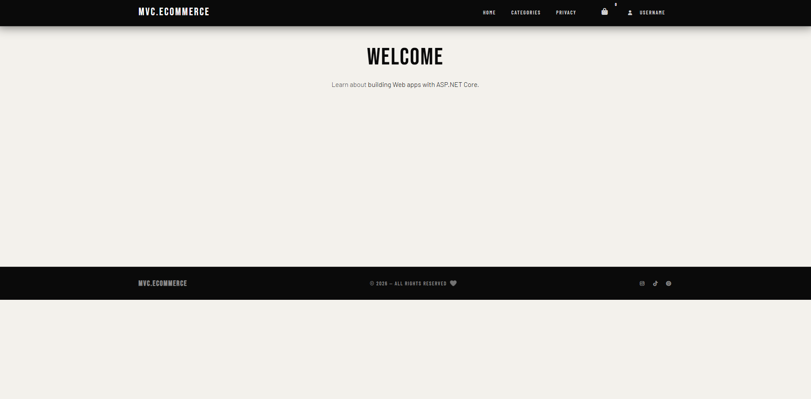
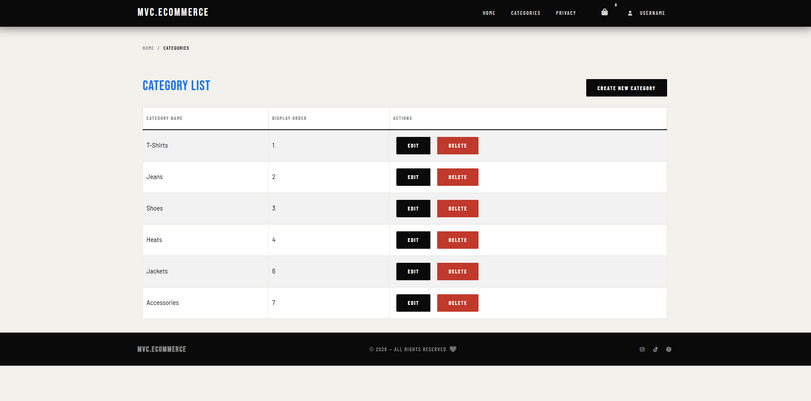
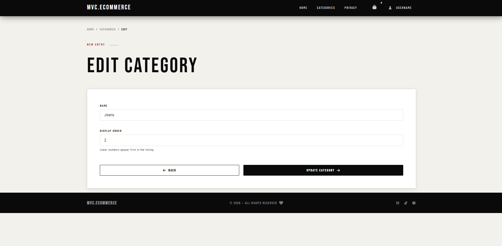

# aspnetcore-mvc-ecommerce

A complete, production-ready e-commerce web application built with ASP.NET Core MVC. This project follows the comprehensive Udemy course and implements real-world features including product management, shopping cart, secure payment processing, and order management.

---
## 📸 Screenshots





## ✨ Features

### 🛍️ Customer Features

- **📦 Product Catalog** — Browse products with categories, filtering, and search
- **🖼️ Multiple Product Images** — View products from different angles
- **🛒 Shopping Cart** — Add, remove, and update quantities
- **💳 Secure Checkout** — Stripe payment integration
- **📧 Order Confirmation** — Email notifications for orders
- **👤 User Authentication** — Register, login, and profile management

### ⚙️ Admin Features

- **📊 Dashboard** — Overview of sales and orders
- **📦 Product Management** — CRUD operations for products
- **🏷️ Category Management** — Organize products by category
- **📋 Order Management** — Process and track orders
- **👥 User Management** — Manage customer accounts

---

## 🛠️ Tech Stack

| Technology | Purpose |
|---|---|
| ASP.NET Core MVC 10 | Web framework |
| Entity Framework Core | ORM & database operations |
| ASP.NET Core Identity | Authentication & authorization |
| SQL Server | Database |
| Stripe | Payment processing |
| Bootstrap | UI/UX styling |
| N-tier Architecture | Application architecture |
| Repository Pattern | Data access pattern |

---

## 🚀 Getting Started

### Prerequisites

- [.NET 10 SDK](https://dotnet.microsoft.com/download/dotnet/10.0)
- [SQL Server](https://www.microsoft.com/en-us/sql-server/) (LocalDB, Express, or Developer)
- [Visual Studio 2022](https://visualstudio.microsoft.com/) or [VS Code](https://code.visualstudio.com/)
- [Stripe Account](https://stripe.com/) (for payments)

### Installation

1. **Clone the repository**

   ```bash
   git clone https://github.com/fatihkaradag/aspnetcore-mvc-ecommerce.git
   cd aspnetcore-mvc-ecommerce
   ```

2. **Run the application**

   ```bash
   dotnet run
   ```

3. **Navigate to the app**

   Open your browser and go to `https://localhost:5001` or `http://localhost:5000`

---

## 📄 License

This project is licensed under the MIT License — see the [LICENSE](LICENSE) file for details.

---

## 🙏 Acknowledgments

- **Bhrugen Patel** — For the excellent comprehensive course
- **DotNetMastery** — For quality .NET training content
